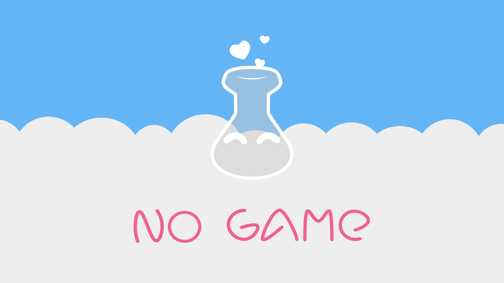

## Welcome ♥

LÖVE is a framework for making 2D games in the Lua programming language. It can be used in anything from friendly open-source projects, to evil, closed-source proprietary ones.

If you are new and unfamiliar with LÖVE and/or Lua, I genuinely recommend clicking the "How to LÖVE" link on the sidebar.

This wiki will refer to what is implemented (so far) in LÖVE Potion which will follow the official LÖVE API. Please note that not *all* functions of LÖVE will be able to be implemented for various reasons. The 3DS version also has a somewhat limited selection of the graphics API.



## Hello World
This is the full source for 'hello world' in LÖVE Potion.

```lua
function love.draw()
    love.graphics.print('Hello World!', 200, 120)
end
```
