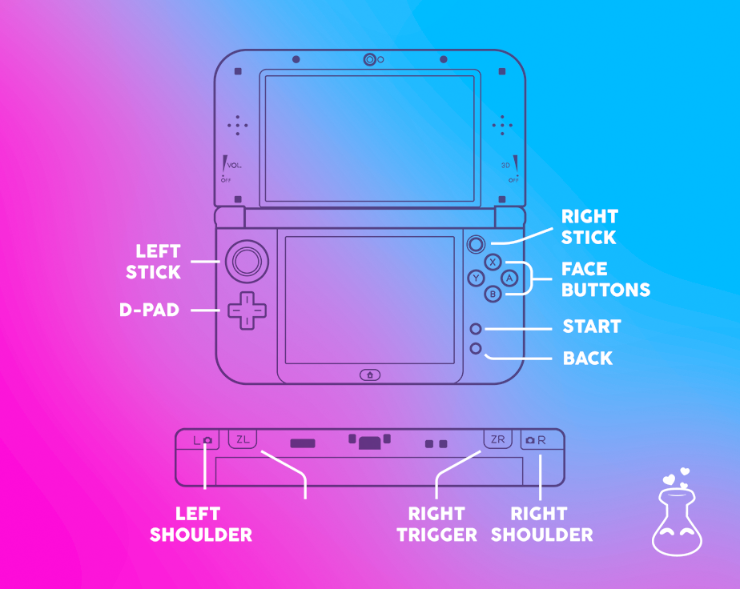
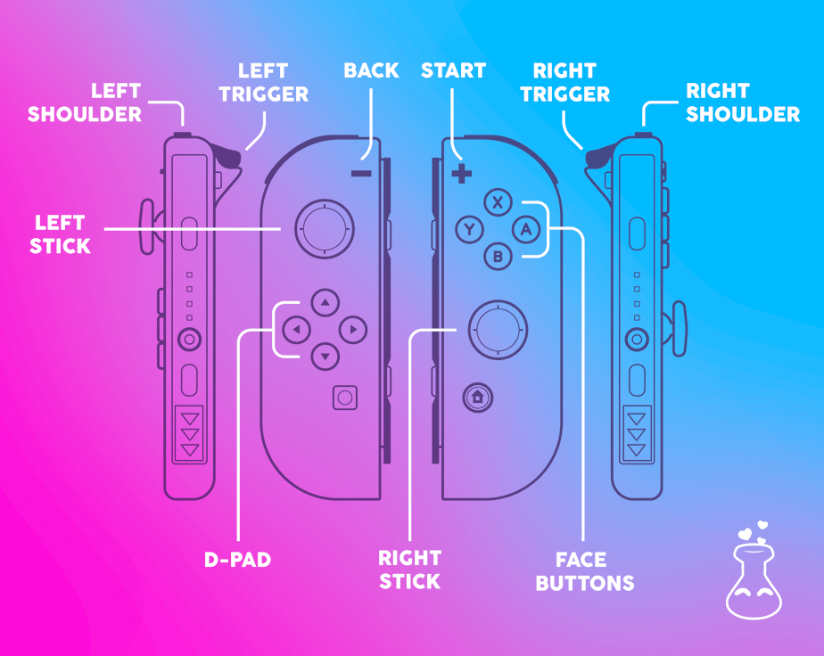

!> Löve Potion is a work in progress, so things may be missing. Please open an issue on the [GitHub Repository](https://github.com/TurtleP/LovePotion) if there's a feature you'd like to request.

## Drawing

On a Nintendo 3DS, this was a big hurdle. The initial codebase would rely on a call to `love.graphics.setScreen(screen)`. Now this is no longer the case. As of version 2.0.0, the `love.draw` callback has a `screen` parameter. This does not affect the Nintendo Switch version.

For example, if you wish to draw to only *one* screen. You would simply check against the `screen` value that was passed in:

```lua
function love.draw(screen)
    if screen == "top" then
        -- render top screen
    end
end
```

At first glance, it seems a bit odd, right? Well it can be fixed up and dealt with in numerous ways. For more advanced users, one of those is creating a game state tracker which that registers function callbacks based on the screen, saving a lot of effort.

## System Font Loading

One can load a system font using the follwing names in place of the path parameter for `love.graphics.newFont`:

### Nintendo 3DS

|Name|Notes|
|----|-----------|
|standard|JPN, USA, EUR, and AUS regions font|
|chinese|Chinese font|
|korean|Korean font|
|taiwanese|Taiwanese font|

### Nintendo Switch

|Name|Notes|
|----|-----------|
|standard|JPN, USA, EUR, and AUS regions font|
|chinese simplified|Simplified Chinese font|
|chinese traditional|Traditional Chinese font|
|extended chinese simplified|Extended Simplified Chinese font|
|korean|Korean font|
|nintendo extended|Nintendo Extended Symbols font|

The Standard font on Nintendo 3DS holds the glyph data for various symbols, like the Play Coin icon. However, these glyphs are stored in the Nintendo Extended Symbols font on Nintendo Switch. Here is a basic example:

```lua
local utf8 = require("utf8")

-- get the encoded utf8 of the Play Coin icon
local glyph = utf8.char("0xE075")

function love.load()
    -- if we're on Switch, set extended as our current font
    if love._console_name == "Switch" then
        love.graphics.setNewFont("nintendo extended", 14)
    end
end

function love.draw(screen)
    -- this will only render on the top
    -- screen for 3DS and will render on Switch regardless
    if (screen and screen ~= "top") then
        return
    end

    love.graphics.print(glyph)
end
```

## Extended System Functions

Since the Nintendo 3DS and Nintendo Switch are a bit different than your traditional LOVE environment, the following `system` module functions were added:

- `love.system.getNetworkStatus()`
    - Returns whether or not the system has an internet connection
- `love.system.getUsername()`
    - Returns the name of the user running Löve Potion (or your game)
- `love.system.getLanguage()`
    - Returns the current System Language as a string

These are especially useful for either UI, netplay, or even multi-language support!

## Console-Only Constants

Both the 3DS and Switch versions of Löve Potion have the following constants:

- `love._console_name`
    - Returns the name of the console, "3DS" or "Switch"
- `love._potion_version`
    - Returns the version of Löve Potion

## Software Keyboard

Calling `love.keyboard.setTextInput` brings up the System Software Keyboard applet. Pass a table to configure it:

| Config | Notes |
|--------|--------|
| type |  basic, numpad, and standard<sup>1</sup>|
| isPassword | makes the text hidden after entry |
| hint | Text to prompt for on the input |

<sup>1</sup> Nintendo Switch only

## Gamepad Constants

?> Löve Potion only uses the `love.gamepad*` callbacks for input handling (with the joycon or the 3DS system itself). For a list of button names, please see [the official LÖVE wiki](https://love2d.org/wiki/GamepadButton).

### Nintendo 3DS



### Nintendo Switch



## Miscellaneous

### Nintendo 3DS

The Nintendo 3DS has stereoscopic 3D--it allows for the use of 3D effects on its top screen without 3D glasses. To control this, use `love.graphics.setDepth`. Note that this will not have any affect on Nintendo 2DS systems.

## Debugging Your Game

Debugging Löve Potion games has always been a big pain. We couldn't use the toolchain provided console, especially on Nintendo Switch due to complications. However, it is *highly* advised that users [take a look at lovebird](https://github.com/rxi/lovebird). It's a very useful utility that can debug your game over your local area network.

!> The following notice may be removed if the root cause is found (as there is 5.2 compatability which should fix coroutines) or the consoles get LuaJIT.

**However**, it should be noted that there may be issues due to coroutines. If you run into issues, try setting the time out values to a non-zero value, such as 5. Regarding the coroutines, specifically at lines 661 and 664, you *might* need to comment them out so everything works properly and instead return the value in the argument for the coroutine. For example, line 661 would be `return nil` instead of `coroutine.yield(nil)`.
